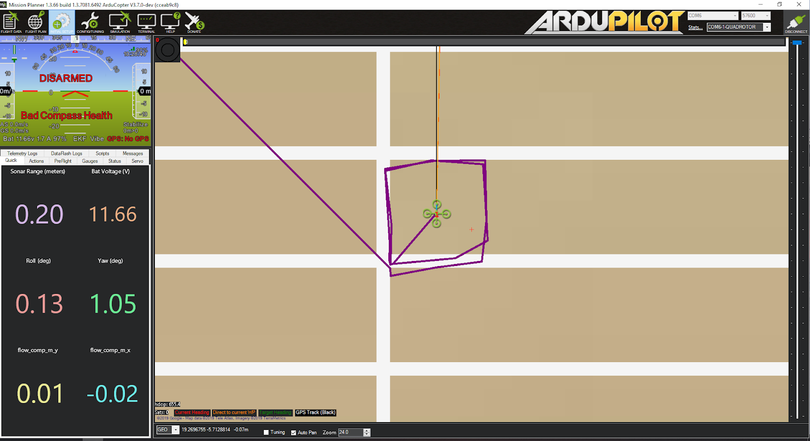

# 飞行任务

本次课程设计需要解决的任务是通过一系列的传感器定位方案和控制手段使得无人机能够在如下地图中稳定的自主飞行、路径规划以及对地面物体的目标识别。


## 1. Ardupilot飞控

本次项目中采用Ardupilot4.1.0飞控软件作为飞行器的主控制器。它提供了USART、I2C、USB等接口采集传感器信号以获得自身位姿、高度、气压、速度等关键信息并通过EKF2、EKF3模块进行多传感器融合以实现高精度对环境和自身状况的感知。Ardupilot4.1.0内部控制器采用PID控制器，控制指令与传感器获取到的实时状态构成反馈回路以实现闭环调节。

Ardupilot4.1.0 可以根据传感器获取的数据进行不同类型的闭环调节，例如高度控制、位置控制、自稳控制等，以下是几种常用的飞行模式：

|    Mode     |                          Function                          |
| :---------: | :--------------------------------------------------------: |
|   *Acro*    |          保持姿态稳定、需要使用遥控器进行手动操作          |
| *Stabilize* | 自行调节飞行器的roll角与pitch角，常用于飞机解锁与起飞阶段  |
| *Alt Hold*  |             自行控制高度、roll角、pitch角稳定              |
|   *Auto*    |       自行执行预先指定的任务，例如按照规定的航点飞行       |
|  *Circle*   |                     飞行器自行绕圈飞行                     |
|  *Guided*   | 根据传感器数据自行执行定点控速飞行任务，自主飞行常用该模式 |
|   *Land*    |       降落模式，可以通过遥控器切换也可以使用程序给定       |
|  *Loiter*   |      自行控制飞行姿态和飞行高度，可以使无人机稳定悬停      |
| *Pos Hold*  |        类似于loiter模式，但是使用遥控器进行手动操作        |
|    *RTL*    |                 返航模式，回到起飞点并降落                 |

根据飞行任务很容易知道，我们需要设计飞行器使其进行定高定点的稳定飞行才可以完成任务，因此我们需要用使用`Guided`模式进行无人机的自主飞行。在无人机的解锁和起飞阶段可以使用`Stabilize`模式

## 2. GPS定位飞行

本章节测试飞行器在GPS引导下的飞行。经过实验发现，**Z410B产品出场设定的参数列表是无法使用的**，因此需要我们重新进行参数的设定。我们采用EKF2模块来对GPS回传的位置信息进行姿态融合，首先通过Mission Planner地面站配置无人机的飞行参数。

```c++
AHRS_EKF_TYPE = 2   	//AHRS姿态航向系统采用EKF2模块融合的位姿信息
COMPASS_USE = 1			//开启电子罗盘1
COMPASS_USE2 = 1		//开启电子罗盘2
COMPASS_USE3 = 0      	//关闭电子罗盘3
EK2_ENABLE = 1			//启用EKF2模块
EK2_GPS_TYPE = 1		//EKF2模块融合GPS提供的位置信息
EK3_ENABLE = 0			//关闭EKF3模块
GPS_TYPE = 1			//启用GPS模块
```

设置完参数后，我们采用dronekit-python编写飞行器控制指令程序。

```python
from __future__ import print_function
import time
from dronekit import connect, VehicleMode, LocationGlobalRelative
from pymavlink import mavutil

# 连接的pixhawk飞控硬件的端口 
connection_string = '/dev/ttyUSB0'
print('Connecting to vehicle on: %s' % connection_string)
# connect函数将会返回一个Vehicle类型的对象，即此处的vehicle  
# 即可认为是无人机的主体，通过vehicle对象，我们可以直接控制无人机  
vehicle = connect(connection_string,wait_ready=True,baud=921600)

# 定义arm_and_takeoff函数，使无人机解锁并起飞到目标高度  
# 参数aTargetAltitude即为目标高度，单位为米  
def arm_and_takeoff(aTargetAltitude):
   # 解锁无人机（电机将开始旋转）  
    print("Arming motors")
   # 将无人机的飞行模式切换成"GUIDED"（一般建议在GUIDED模式下控制无人机）  
    vehicle.mode = VehicleMode("GUIDED")
   # 通过设置vehicle.armed状态变量为True，解锁无人机  
    vehicle.armed = True
   # 在无人机起飞之前，确认电机已经解锁  
    while not vehicle.armed:
        print(" Waiting for arming...")
        time.sleep(1)

    # 发送起飞指令  
    print("Taking off!")
    # simple_takeoff将发送指令，使无人机起飞并上升到目标高度  
    vehicle.simple_takeoff(aTargetAltitude)

    # 在无人机上升到目标高度之前，阻塞程序  
    while True:
        print(" Altitude: ", vehicle.location.global_relative_frame.alt)
        # 当高度上升到目标高度的0.95倍时，即认为达到了目标高度，退出循环  
        # vehicle.location.global_relative_frame.alt为相对于home点的高度  
        if vehicle.location.global_relative_frame.alt >= aTargetAltitude * 0.95:
            print("Reached target altitude")
            break
        # 等待1s  
        time.sleep(1)

# 调用上面声明的arm_and_takeoff函数，目标高度1m  
arm_and_takeoff(1)
#悬停10s
time.sleep(10)
# 发送"降落"指令  
print("Land")
# 降落，只需将无人机的飞行模式切换成"Land"  
# 无人机会在当前位置自动降落 
vehicle.mode = VehicleMode("LAND")

# 退出之前，清除vehicle对象  
print("Close vehicle object")
vehicle.close()
```

运行上面的程序便可以实现采用GPS的定位飞行。然而经过实验检验使用GPS进行稳定飞行的条件是搜星数量**至少要达到18~23颗左右**，这意味着必须在开阔的室外环境才可以使用GPS传感器进行定点稳定控制飞行。

## 3. Optical Flow定位飞行


## 4. intel T265定位飞行

本章节我们使用intel T265双目相机作为环境感知和自身姿态定位的传感器来使无人机进行更高鲁棒性和精确性的自主飞行。Z410B飞行器中树莓派内已经安装了`librealsense`和`mavros`软件开发包，我们可以使用这些软件开发包获取intel T265输出的位姿信息并建立它与Ardupilot飞控之间的通信。我们将避免使用`ROS`这种复杂通信系统来进行数据交互。

首先需要配置飞控飞行参数：

```C++
AHRS_EKF_TYPE = 3			//AHRS姿态航向系统采用EKF3模块融合的位姿信息
COMPASS_USE = 0             //禁用所有的电子罗盘
COMPASS_USE2 =0
COMPASS_USE3 = 0
EK2_ENABLE = 0				//关闭EKF2
EK3_ENABLE = 1              //开启EKF3
EK3_SRC_OPTIONS = 0         //EKF3多传感器数据融合来源
EK3_SRC1_POSXY = 6          //位置数据来自intel T265
EK3_SRC1_POSZ = 2           //高度数据来自对地激光测距
EK3_SRC1_VELXY = 6          //水平速度数据来自intel T265
EK3_SRC1_VELZ = 6           //垂直速度数据来自intel T265
EK3_SRC1_YAW = 6            //Yaw角速度来自intel T265
EK3_SRC2_POSXY = 0      
EK3_SRC2_POSZ = 1           //高度数据来自气压计(室内情况下实际上气压计的工作表现不佳)
EK3_SRC2_VELXY = 0
EK3_SRC2_VELZ = 0
EK3_SRC2_YAW = 0
EK3_SRC3_POSXY = 0
EK3_SRC3_POSZ = 1           //高度数据来自气压计
EK3_SRC3_VELXY = 5          //水平速度数据来自光流
EK3_SRC3_VELZ = 0
EK3_SRC3_YAW = 0
GPS_TYPE = 0                //关闭GPS
RNGFND1_GNDCLEAR = 10       //对地激光初始距离10cm
RNGFND1_MAX_CM = 700        //对地激光最大测量距离
RNGFND1_MIN_CM = 10         //对地激光最小测量距离
VISO_TYPE = 2               //打开intel T265视觉里程计
```

物理连接如下图所示：


数据流如下所示：


我们首先通过`librealsense`中提供的API读取出intel T265计算得到的位姿和跟踪置信度，随后调用`vision_to_mavros`库中的`t265_to_mavlink.py`将intel T265输出的位姿转换成`mavros`通信格式，最终通过`mavlink`指令发送给`Ardupilot`飞控。`t265_to_mavlink.py`代码如下：

```python
import sys
sys.path.append("/usr/local/lib/")

# Set MAVLink protocol to 2.
import os
os.environ["MAVLINK20"] = "1"

# Import the libraries
import pyrealsense2 as rs
import numpy as np
import transformations as tf
import math as m
import time
import argparse
import threading
import signal

from time import sleep
from apscheduler.schedulers.background import BackgroundScheduler
from pymavlink import mavutil


# Replacement of the standard print() function to flush the output
def progress(string):
    print(string, file=sys.stdout)
    sys.stdout.flush()


#######################################
# Parameters
#######################################

# Default configurations for connection to the FCU
connection_string_default = '/dev/ttyUSB0'
connection_baudrate_default = 921600
connection_timeout_sec_default = 5

# Transformation to convert different camera orientations to NED convention. Replace camera_orientation_default for your configuration.
#   0: Forward, USB port to the right
#   1: Downfacing, USB port to the right 
#   2: Forward, 45 degree tilted down, USB port to the right
#   3: Downfacing, USB port to the back
# Important note for downfacing camera: you need to tilt the vehicle's nose up a little - not flat - before you run the script, otherwise the initial yaw will be randomized, read here for more details: https://github.com/IntelRealSense/librealsense/issues/4080. Tilt the vehicle to any other sides and the yaw might not be as stable.
camera_orientation_default = 0

# https://mavlink.io/en/messages/common.html#VISION_POSITION_ESTIMATE
enable_msg_vision_position_estimate = True
vision_position_estimate_msg_hz_default = 30.0

# https://mavlink.io/en/messages/ardupilotmega.html#VISION_POSITION_DELTA
enable_msg_vision_position_delta = False
vision_position_delta_msg_hz_default = 30.0

# https://mavlink.io/en/messages/common.html#VISION_SPEED_ESTIMATE
enable_msg_vision_speed_estimate = True
vision_speed_estimate_msg_hz_default = 30.0

# https://mavlink.io/en/messages/common.html#STATUSTEXT
enable_update_tracking_confidence_to_gcs = True
update_tracking_confidence_to_gcs_hz_default = 1.0

# Monitor user's online input via keyboard, can only be used when runs from terminal
enable_user_keyboard_input = False

# Default global position for EKF home/ origin
enable_auto_set_ekf_home = False
home_lat = 151269321    # Somewhere random
home_lon = 16624301     # Somewhere random
home_alt = 163000       # Somewhere random

# TODO: Taken care of by ArduPilot, so can be removed (once the handling on AP side is confirmed stable)
# In NED frame, offset from the IMU or the center of gravity to the camera's origin point
body_offset_enabled = 0
body_offset_x = 0  # In meters (m)
body_offset_y = 0  # In meters (m)
body_offset_z = 0  # In meters (m)

# Global scale factor, position x y z will be scaled up/down by this factor
scale_factor = 1.0

# Enable using yaw from compass to align north (zero degree is facing north)
compass_enabled = 0

# pose data confidence: 0x0 - Failed / 0x1 - Low / 0x2 - Medium / 0x3 - High 
pose_data_confidence_level = ('FAILED', 'Low', 'Medium', 'High')

# lock for thread synchronization
lock = threading.Lock()
mavlink_thread_should_exit = False

# default exit code is failure - a graceful termination with a
# terminate signal is possible.
exit_code = 1


#######################################
# Global variables
#######################################

# FCU connection variables

# Camera-related variables
pipe = None
pose_sensor = None
linear_accel_cov = 0.01
angular_vel_cov  = 0.01

# Data variables
data = None
prev_data = None
H_aeroRef_aeroBody = None
V_aeroRef_aeroBody = None
heading_north_yaw = None
current_confidence_level = None
current_time_us = 0

# Increment everytime pose_jumping or relocalization happens
# See here: https://github.com/IntelRealSense/librealsense/blob/master/doc/t265.md#are-there-any-t265-specific-options
# For AP, a non-zero "reset_counter" would mean that we could be sure that the user's setup was using mavlink2
reset_counter = 1

#######################################
# Parsing user' inputs
#######################################

parser = argparse.ArgumentParser(description='Reboots vehicle')
parser.add_argument('--connect',
                    help="Vehicle connection target string. If not specified, a default string will be used.")
parser.add_argument('--baudrate', type=float,
                    help="Vehicle connection baudrate. If not specified, a default value will be used.")
parser.add_argument('--vision_position_estimate_msg_hz', type=float,
                    help="Update frequency for VISION_POSITION_ESTIMATE message. If not specified, a default value will be used.")
parser.add_argument('--vision_position_delta_msg_hz', type=float,
                    help="Update frequency for VISION_POSITION_DELTA message. If not specified, a default value will be used.")
parser.add_argument('--vision_speed_estimate_msg_hz', type=float,
                    help="Update frequency for VISION_SPEED_DELTA message. If not specified, a default value will be used.")
parser.add_argument('--scale_calib_enable', default=False, action='store_true',
                    help="Scale calibration. Only run while NOT in flight")
parser.add_argument('--camera_orientation', type=int,
                    help="Configuration for camera orientation. Currently supported: forward, usb port to the right - 0; downward, usb port to the right - 1, 2: forward tilted down 45deg")
parser.add_argument('--debug_enable',type=int,
                    help="Enable debug messages on terminal")

args = parser.parse_args()

connection_string = args.connect
connection_baudrate = args.baudrate
vision_position_estimate_msg_hz = args.vision_position_estimate_msg_hz
vision_position_delta_msg_hz = args.vision_position_delta_msg_hz
vision_speed_estimate_msg_hz = args.vision_speed_estimate_msg_hz
scale_calib_enable = args.scale_calib_enable
camera_orientation = args.camera_orientation
debug_enable = args.debug_enable

# Using default values if no specified inputs
if not connection_string:
    connection_string = connection_string_default
    progress("INFO: Using default connection_string %s" % connection_string)
else:
    progress("INFO: Using connection_string %s" % connection_string)

if not connection_baudrate:
    connection_baudrate = connection_baudrate_default
    progress("INFO: Using default connection_baudrate %s" % connection_baudrate)
else:
    progress("INFO: Using connection_baudrate %s" % connection_baudrate)

if not vision_position_estimate_msg_hz:
    vision_position_estimate_msg_hz = vision_position_estimate_msg_hz_default
    progress("INFO: Using default vision_position_estimate_msg_hz %s" % vision_position_estimate_msg_hz)
else:
    progress("INFO: Using vision_position_estimate_msg_hz %s" % vision_position_estimate_msg_hz)
    
if not vision_position_delta_msg_hz:
    vision_position_delta_msg_hz = vision_position_delta_msg_hz_default
    progress("INFO: Using default vision_position_delta_msg_hz %s" % vision_position_delta_msg_hz)
else:
    progress("INFO: Using vision_position_delta_msg_hz %s" % vision_position_delta_msg_hz)

if not vision_speed_estimate_msg_hz:
    vision_speed_estimate_msg_hz = vision_speed_estimate_msg_hz_default
    progress("INFO: Using default vision_speed_estimate_msg_hz %s" % vision_speed_estimate_msg_hz)
else:
    progress("INFO: Using vision_speed_estimate_msg_hz %s" % vision_speed_estimate_msg_hz)

if body_offset_enabled == 1:
    progress("INFO: Using camera position offset: Enabled, x y z is %s %s %s" % (body_offset_x, body_offset_y, body_offset_z))
else:
    progress("INFO: Using camera position offset: Disabled")

if compass_enabled == 1:
    progress("INFO: Using compass: Enabled. Heading will be aligned to north.")
else:
    progress("INFO: Using compass: Disabled")

if scale_calib_enable == True:
    progress("\nINFO: SCALE CALIBRATION PROCESS. DO NOT RUN DURING FLIGHT.\nINFO: TYPE IN NEW SCALE IN FLOATING POINT FORMAT\n")
else:
    if scale_factor == 1.0:
        progress("INFO: Using default scale factor %s" % scale_factor)
    else:
        progress("INFO: Using scale factor %s" % scale_factor)

if not camera_orientation:
    camera_orientation = camera_orientation_default
    progress("INFO: Using default camera orientation %s" % camera_orientation)
else:
    progress("INFO: Using camera orientation %s" % camera_orientation)

if camera_orientation == 0:     # Forward, USB port to the right
    H_aeroRef_T265Ref   = np.array([[0,0,-1,0],[1,0,0,0],[0,-1,0,0],[0,0,0,1]])
    H_T265body_aeroBody = np.linalg.inv(H_aeroRef_T265Ref)
elif camera_orientation == 1:   # Downfacing, USB port to the right
    H_aeroRef_T265Ref   = np.array([[0,0,-1,0],[1,0,0,0],[0,-1,0,0],[0,0,0,1]])
    H_T265body_aeroBody = np.array([[0,1,0,0],[1,0,0,0],[0,0,-1,0],[0,0,0,1]])
elif camera_orientation == 2:   # 45degree forward, USB port to the right
    H_aeroRef_T265Ref   = np.array([[0,0,-1,0],[1,0,0,0],[0,-1,0,0],[0,0,0,1]])
    H_T265body_aeroBody = (tf.euler_matrix(m.pi/4, 0, 0)).dot(np.linalg.inv(H_aeroRef_T265Ref))
elif camera_orientation == 3:   # Downfacing, USB port to the back
    H_aeroRef_T265Ref   = np.array([[0,0,-1,0],[1,0,0,0],[0,-1,0,0],[0,0,0,1]])
    H_T265body_aeroBody = np.array([[-1,0,0,0],[0,1,0,0],[0,0,-1,0],[0,0,0,1]])
else:                           # Default is facing forward, USB port to the right
    H_aeroRef_T265Ref   = np.array([[0,0,-1,0],[1,0,0,0],[0,-1,0,0],[0,0,0,1]])
    H_T265body_aeroBody = np.linalg.inv(H_aeroRef_T265Ref)

if not debug_enable:
    debug_enable = 0
else:
    debug_enable = 1
    np.set_printoptions(precision=4, suppress=True) # Format output on terminal 
    progress("INFO: Debug messages enabled.")


#######################################
# Functions - MAVLink
#######################################

def mavlink_loop(conn, callbacks):
    '''a main routine for a thread; reads data from a mavlink connection,
    calling callbacks based on message type received.
    '''
    interesting_messages = list(callbacks.keys())
    while not mavlink_thread_should_exit:
        # send a heartbeat msg
        conn.mav.heartbeat_send(mavutil.mavlink.MAV_TYPE_ONBOARD_CONTROLLER,
                                mavutil.mavlink.MAV_AUTOPILOT_GENERIC,
                                0,
                                0,
                                0)
        m = conn.recv_match(type=interesting_messages, timeout=1, blocking=True)
        if m is None:
            continue
        callbacks[m.get_type()](m)

# https://mavlink.io/en/messages/common.html#VISION_POSITION_ESTIMATE
def send_vision_position_estimate_message():
    global current_time_us, H_aeroRef_aeroBody, reset_counter
    with lock:
        if H_aeroRef_aeroBody is not None:
            # Setup angle data
            rpy_rad = np.array( tf.euler_from_matrix(H_aeroRef_aeroBody, 'sxyz'))

            # Setup covariance data, which is the upper right triangle of the covariance matrix, see here: https://files.gitter.im/ArduPilot/VisionProjects/1DpU/image.png
            # Attemp #01: following this formula https://github.com/IntelRealSense/realsense-ros/blob/development/realsense2_camera/src/base_realsense_node.cpp#L1406-L1411
            cov_pose    = linear_accel_cov * pow(10, 3 - int(data.tracker_confidence))
            cov_twist   = angular_vel_cov  * pow(10, 1 - int(data.tracker_confidence))
            covariance  = np.array([cov_pose, 0, 0, 0, 0, 0,
                                       cov_pose, 0, 0, 0, 0,
                                          cov_pose, 0, 0, 0,
                                            cov_twist, 0, 0,
                                               cov_twist, 0,
                                                  cov_twist])

            # Send the message
            conn.mav.vision_position_estimate_send(
                current_time_us,            # us Timestamp (UNIX time or time since system boot)
                H_aeroRef_aeroBody[0][3],   # Global X position
                H_aeroRef_aeroBody[1][3],   # Global Y position
                H_aeroRef_aeroBody[2][3],   # Global Z position
                rpy_rad[0],	                # Roll angle
                rpy_rad[1],	                # Pitch angle
                rpy_rad[2],	                # Yaw angle
                covariance,                 # Row-major representation of pose 6x6 cross-covariance matrix
                reset_counter               # Estimate reset counter. Increment every time pose estimate jumps.
            )

# https://mavlink.io/en/messages/ardupilotmega.html#VISION_POSITION_DELTA
def send_vision_position_delta_message():
    global current_time_us, current_confidence_level, H_aeroRef_aeroBody
    with lock:
        if H_aeroRef_aeroBody is not None:
            # Calculate the deltas in position, attitude and time from the previous to current orientation
            H_aeroRef_PrevAeroBody      = send_vision_position_delta_message.H_aeroRef_PrevAeroBody
            H_PrevAeroBody_CurrAeroBody = (np.linalg.inv(H_aeroRef_PrevAeroBody)).dot(H_aeroRef_aeroBody)

            delta_time_us    = current_time_us - send_vision_position_delta_message.prev_time_us
            delta_position_m = [H_PrevAeroBody_CurrAeroBody[0][3], H_PrevAeroBody_CurrAeroBody[1][3], H_PrevAeroBody_CurrAeroBody[2][3]]
            delta_angle_rad  = np.array( tf.euler_from_matrix(H_PrevAeroBody_CurrAeroBody, 'sxyz'))

            # Send the message
            conn.mav.vision_position_delta_send(
                current_time_us,    # us: Timestamp (UNIX time or time since system boot)
                delta_time_us,	    # us: Time since last reported camera frame
                delta_angle_rad,    # float[3] in radian: Defines a rotation vector in body frame that rotates the vehicle from the previous to the current orientation
                delta_position_m,   # float[3] in m: Change in position from previous to current frame rotated into body frame (0=forward, 1=right, 2=down)
                current_confidence_level # Normalized confidence value from 0 to 100. 
            )

            # Save static variables
            send_vision_position_delta_message.H_aeroRef_PrevAeroBody = H_aeroRef_aeroBody
            send_vision_position_delta_message.prev_time_us = current_time_us

# https://mavlink.io/en/messages/common.html#VISION_SPEED_ESTIMATE
def send_vision_speed_estimate_message():
    global current_time_us, V_aeroRef_aeroBody, reset_counter
    with lock:
        if V_aeroRef_aeroBody is not None:

            # Attemp #01: following this formula https://github.com/IntelRealSense/realsense-ros/blob/development/realsense2_camera/src/base_realsense_node.cpp#L1406-L1411
            cov_pose    = linear_accel_cov * pow(10, 3 - int(data.tracker_confidence))
            covariance  = np.array([cov_pose,   0,          0,
                                    0,          cov_pose,   0,
                                    0,          0,          cov_pose])
            
            # Send the message
            conn.mav.vision_speed_estimate_send(
                current_time_us,            # us Timestamp (UNIX time or time since system boot)
                V_aeroRef_aeroBody[0][3],   # Global X speed
                V_aeroRef_aeroBody[1][3],   # Global Y speed
                V_aeroRef_aeroBody[2][3],   # Global Z speed
                covariance,                 # covariance
                reset_counter               # Estimate reset counter. Increment every time pose estimate jumps.
            )

# Update the changes of confidence level on GCS and terminal
def update_tracking_confidence_to_gcs():
    if data is not None and update_tracking_confidence_to_gcs.prev_confidence_level != data.tracker_confidence:
        confidence_status_string = 'Tracking confidence: ' + pose_data_confidence_level[data.tracker_confidence]
        send_msg_to_gcs(confidence_status_string)
        update_tracking_confidence_to_gcs.prev_confidence_level = data.tracker_confidence

# https://mavlink.io/en/messages/common.html#STATUSTEXT
def send_msg_to_gcs(text_to_be_sent):
    # MAV_SEVERITY: 0=EMERGENCY 1=ALERT 2=CRITICAL 3=ERROR, 4=WARNING, 5=NOTICE, 6=INFO, 7=DEBUG, 8=ENUM_END
    text_msg = 'T265: ' + text_to_be_sent
    conn.mav.statustext_send(mavutil.mavlink.MAV_SEVERITY_INFO, text_msg.encode())
    progress("INFO: %s" % text_to_be_sent)


# Send a mavlink SET_GPS_GLOBAL_ORIGIN message (http://mavlink.org/messages/common#SET_GPS_GLOBAL_ORIGIN), which allows us to use local position information without a GPS.
def set_default_global_origin():
    conn.mav.set_gps_global_origin_send(
        1,
        home_lat, 
        home_lon,
        home_alt
    )

# Send a mavlink SET_HOME_POSITION message (http://mavlink.org/messages/common#SET_HOME_POSITION), which allows us to use local position information without a GPS.
def set_default_home_position():
    x = 0
    y = 0
    z = 0
    q = [1, 0, 0, 0]   # w x y z

    approach_x = 0
    approach_y = 0
    approach_z = 1

    conn.mav.set_home_position_send(
        1,
        home_lat, 
        home_lon,
        home_alt,
        x,
        y,
        z,
        q,
        approach_x,
        approach_y,
        approach_z
    )


# Request a timesync update from the flight controller, for future work.
# TODO: Inspect the usage of timesync_update 
def update_timesync(ts=0, tc=0):
    if ts == 0:
        ts = int(round(time.time() * 1000))
    conn.mav.timesync_send(
        tc,     # tc1
        ts      # ts1
    )

# Listen to attitude data to acquire heading when compass data is enabled
def att_msg_callback(value):
    global heading_north_yaw
    if heading_north_yaw is None:
        heading_north_yaw = value.yaw
        progress("INFO: Received first ATTITUDE message with heading yaw %.2f degrees" % m.degrees(heading_north_yaw))

#######################################
# Functions - T265
#######################################

def increment_reset_counter():
    global reset_counter
    if reset_counter >= 255:
        reset_counter = 1
    reset_counter += 1

# List of notification events: https://github.com/IntelRealSense/librealsense/blob/development/include/librealsense2/h/rs_types.h
# List of notification API: https://github.com/IntelRealSense/librealsense/blob/development/common/notifications.cpp
def realsense_notification_callback(notif):
    progress("INFO: T265 event: " + notif)
    if notif.get_category() is rs.notification_category.pose_relocalization:
        increment_reset_counter()
        send_msg_to_gcs('Relocalization detected')

def realsense_connect():
    global pipe, pose_sensor
    
    # Declare RealSense pipeline, encapsulating the actual device and sensors
    pipe = rs.pipeline()

    # Build config object before requesting data
    cfg = rs.config()

    # Enable the stream we are interested in
    cfg.enable_stream(rs.stream.pose) # Positional data

    # Configure callback for relocalization event
    device = cfg.resolve(pipe).get_device()
    pose_sensor = device.first_pose_sensor()
    pose_sensor.set_notifications_callback(realsense_notification_callback)

    # Start streaming with requested config
    pipe.start(cfg)

#######################################
# Functions - Miscellaneous
#######################################

# Monitor user input from the terminal and perform action accordingly
def user_input_monitor():
    global scale_factor
    while True:
        # Special case: updating scale
        if scale_calib_enable == True:
            scale_factor = float(input("INFO: Type in new scale as float number\n"))
            progress("INFO: New scale is %s" % scale_factor)

        if enable_auto_set_ekf_home:
            send_msg_to_gcs('Set EKF home with default GPS location')
            set_default_global_origin()
            set_default_home_position()
            time.sleep(1) # Wait a short while for FCU to start working

        # Add new action here according to the key pressed.
        # Enter: Set EKF home when user press enter
        try:
            c = input()
            if c == "":
                send_msg_to_gcs('Set EKF home with default GPS location')
                set_default_global_origin()
                set_default_home_position()
            else:
                progress("Got keyboard input %s" % c)
        except IOError: pass


#######################################
# Main code starts here
#######################################

try:
    progress("INFO: pyrealsense2 version: %s" % str(rs.__version__))
except Exception:
    # fail silently
    pass

progress("INFO: Starting Vehicle communications")
conn = mavutil.mavlink_connection(
    connection_string,
    autoreconnect = True,
    source_system = 1,
    source_component = 93,
    baud=connection_baudrate,
    force_connected=True,
)

mavlink_callbacks = {
    'ATTITUDE': att_msg_callback,
}

mavlink_thread = threading.Thread(target=mavlink_loop, args=(conn, mavlink_callbacks))
mavlink_thread.start()

# connecting and configuring the camera is a little hit-and-miss.
# Start a timer and rely on a restart of the script to get it working.
# Configuring the camera appears to block all threads, so we can't do
# this internally.

# send_msg_to_gcs('Setting timer...')
signal.setitimer(signal.ITIMER_REAL, 5)  # seconds...

send_msg_to_gcs('Connecting to camera...')
realsense_connect()
send_msg_to_gcs('Camera connected.')

signal.setitimer(signal.ITIMER_REAL, 0)  # cancel alarm

# Send MAVlink messages in the background at pre-determined frequencies
sched = BackgroundScheduler()

if enable_msg_vision_position_estimate:
    sched.add_job(send_vision_position_estimate_message, 'interval', seconds = 1/vision_position_estimate_msg_hz)

if enable_msg_vision_position_delta:
    sched.add_job(send_vision_position_delta_message, 'interval', seconds = 1/vision_position_delta_msg_hz)
    send_vision_position_delta_message.H_aeroRef_PrevAeroBody = tf.quaternion_matrix([1,0,0,0]) 
    send_vision_position_delta_message.prev_time_us = int(round(time.time() * 1000000))

if enable_msg_vision_speed_estimate:
    sched.add_job(send_vision_speed_estimate_message, 'interval', seconds = 1/vision_speed_estimate_msg_hz)

if enable_update_tracking_confidence_to_gcs:
    sched.add_job(update_tracking_confidence_to_gcs, 'interval', seconds = 1/update_tracking_confidence_to_gcs_hz_default)
    update_tracking_confidence_to_gcs.prev_confidence_level = -1

# A separate thread to monitor user input
if enable_user_keyboard_input:
    user_keyboard_input_thread = threading.Thread(target=user_input_monitor)
    user_keyboard_input_thread.daemon = True
    user_keyboard_input_thread.start()
    progress("INFO: Press Enter to set EKF home at default location")

sched.start()

# gracefully terminate the script if an interrupt signal (e.g. ctrl-c)
# is received.  This is considered to be abnormal termination.
main_loop_should_quit = False
def sigint_handler(sig, frame):
    global main_loop_should_quit
    main_loop_should_quit = True
signal.signal(signal.SIGINT, sigint_handler)

# gracefully terminate the script if a terminate signal is received
# (e.g. kill -TERM).  
def sigterm_handler(sig, frame):
    global main_loop_should_quit
    main_loop_should_quit = True
    global exit_code
    exit_code = 0

signal.signal(signal.SIGTERM, sigterm_handler)

if compass_enabled == 1:
    time.sleep(1) # Wait a short while for yaw to be correctly initiated

send_msg_to_gcs('Sending vision messages to FCU')

try:
    while not main_loop_should_quit:
        # Wait for the next set of frames from the camera
        frames = pipe.wait_for_frames()

        # Fetch pose frame
        pose = frames.get_pose_frame()

        # Process data
        if pose:
            with lock:
                # Store the timestamp for MAVLink messages
                current_time_us = int(round(time.time() * 1000000))

                # Pose data consists of translation and rotation
                data = pose.get_pose_data()
                
                # Confidence level value from T265: 0-3, remapped to 0 - 100: 0% - Failed / 33.3% - Low / 66.6% - Medium / 100% - High  
                current_confidence_level = float(data.tracker_confidence * 100 / 3)  

                # In transformations, Quaternions w+ix+jy+kz are represented as [w, x, y, z]!
                H_T265Ref_T265body = tf.quaternion_matrix([data.rotation.w, data.rotation.x, data.rotation.y, data.rotation.z]) 
                H_T265Ref_T265body[0][3] = data.translation.x * scale_factor
                H_T265Ref_T265body[1][3] = data.translation.y * scale_factor
                H_T265Ref_T265body[2][3] = data.translation.z * scale_factor

                # Transform to aeronautic coordinates (body AND reference frame!)
                H_aeroRef_aeroBody = H_aeroRef_T265Ref.dot( H_T265Ref_T265body.dot( H_T265body_aeroBody))

                # Calculate GLOBAL XYZ speed (speed from T265 is already GLOBAL)
                V_aeroRef_aeroBody = tf.quaternion_matrix([1,0,0,0])
                V_aeroRef_aeroBody[0][3] = data.velocity.x
                V_aeroRef_aeroBody[1][3] = data.velocity.y
                V_aeroRef_aeroBody[2][3] = data.velocity.z
                V_aeroRef_aeroBody = H_aeroRef_T265Ref.dot(V_aeroRef_aeroBody)

                # Check for pose jump and increment reset_counter
                if prev_data != None:
                    delta_translation = [data.translation.x - prev_data.translation.x, data.translation.y - prev_data.translation.y, data.translation.z - prev_data.translation.z]
                    delta_velocity = [data.velocity.x - prev_data.velocity.x, data.velocity.y - prev_data.velocity.y, data.velocity.z - prev_data.velocity.z]
                    position_displacement = np.linalg.norm(delta_translation)
                    speed_delta = np.linalg.norm(delta_velocity)

                    # Pose jump is indicated when position changes abruptly. The behavior is not well documented yet (as of librealsense 2.34.0)
                    jump_threshold = 0.1 # in meters, from trials and errors, should be relative to how frequent is the position data obtained (200Hz for the T265)
                    jump_speed_threshold = 20.0 # in m/s from trials and errors, should be relative to how frequent is the velocity data obtained (200Hz for the T265)
                    if (position_displacement > jump_threshold) or (speed_delta > jump_speed_threshold):
                        send_msg_to_gcs('VISO jump detected')
                        if position_displacement > jump_threshold:
                            progress("Position jumped by: %s" % position_displacement)
                        elif speed_delta > jump_speed_threshold:
                            progress("Speed jumped by: %s" % speed_delta)
                        increment_reset_counter()
                    
                prev_data = data

                # Take offsets from body's center of gravity (or IMU) to camera's origin into account
                if body_offset_enabled == 1:
                    H_body_camera = tf.euler_matrix(0, 0, 0, 'sxyz')
                    H_body_camera[0][3] = body_offset_x
                    H_body_camera[1][3] = body_offset_y
                    H_body_camera[2][3] = body_offset_z
                    H_camera_body = np.linalg.inv(H_body_camera)
                    H_aeroRef_aeroBody = H_body_camera.dot(H_aeroRef_aeroBody.dot(H_camera_body))

                # Realign heading to face north using initial compass data
                if compass_enabled == 1:
                    H_aeroRef_aeroBody = H_aeroRef_aeroBody.dot( tf.euler_matrix(0, 0, heading_north_yaw, 'sxyz'))

                # Show debug messages here
                if debug_enable == 1:
                    os.system('clear') # This helps in displaying the messages to be more readable
                    progress("DEBUG: Raw RPY[deg]: {}".format( np.array( tf.euler_from_matrix( H_T265Ref_T265body, 'sxyz')) * 180 / m.pi))
                    progress("DEBUG: NED RPY[deg]: {}".format( np.array( tf.euler_from_matrix( H_aeroRef_aeroBody, 'sxyz')) * 180 / m.pi))
                    progress("DEBUG: Raw pos xyz : {}".format( np.array( [data.translation.x, data.translation.y, data.translation.z])))
                    progress("DEBUG: NED pos xyz : {}".format( np.array( tf.translation_from_matrix( H_aeroRef_aeroBody))))

except Exception as e:
    progress(e)

except:
    send_msg_to_gcs('ERROR IN SCRIPT')  
    progress("Unexpected error: %s" % sys.exc_info()[0])

finally:
    progress('Closing the script...')
    # start a timer in case stopping everything nicely doesn't work.
    signal.setitimer(signal.ITIMER_REAL, 5)  # seconds...
    pipe.stop()
    mavlink_thread_should_exit = True
    mavlink_thread.join()
    conn.close()
    progress("INFO: Realsense pipeline and vehicle object closed.")
    sys.exit(exit_code)
```

运行此份代码后便可以完成intel T265位姿数传输到飞控的功能。我们可以在地面站上检验飞控是否有获取到视觉定位信息。`Ctrl+F`打开`temp`界面，点击`Mavlink Inspector`弹出窗口便可以查看视觉定位信息，如下图所示。

<figure class="half">  
        
</figure>!


